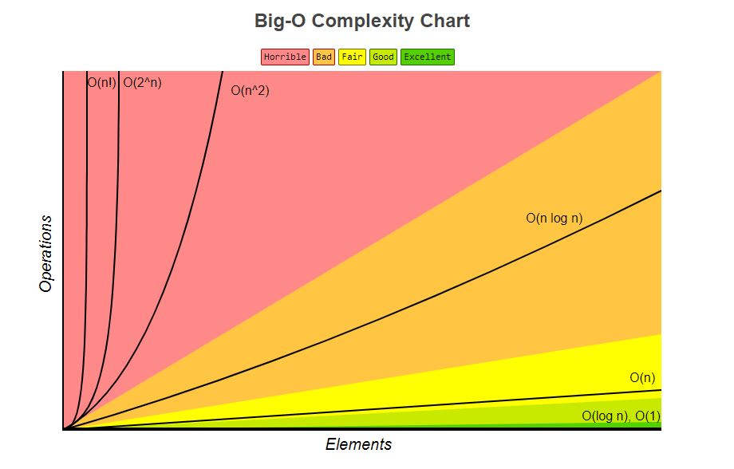

# Too Long Didn't Read Dictionary of Algorithms and Data Structures
> Repository dedicated to a breakdown of data structures and algorithms into short snippets and layman terms.
## Table of Contents

- [Time Complexity](#Time-Complexity )
  - [Big O](#Big-O)
  - [Big Omega](#Big-Omega)
  - [Big Theta](#Big-Theta)
- [Space Complexity](#Space-Complexity )
- [Algorithms](#Algorithms)
  - [Binary Search](#Binary-Search-)
  - [Binary Search](#Bubble-Sort-)
  - [Bubble Sort](#Binary-Search-)
  - [Insertion Sort](#Insertion-Sort-)
  - [Merge Sort](#Merge-Sort-)
- [Data Structures](#Data-Structures)
- [Contributing](#contributing)
- [License](#license)


## Time Complexity

Time complexity is the computational complexity that it takes for a program/function to iterate through the operations by the algorithms in that program.
### Big O
Big O specifcally describes the upper bound of time, or **best case scenario**.


> Refrence: https://www.bigocheatsheet.com/
### Big Omega
Big Omega descripes the opposite of Big O. It descripes the lowest bound of time, or **worst case scenario**.
### Big Theta


## Space Complexity

Space complexity is a measure of the amount of working memory an algorithm needs.

## Algorithms

### Searching :
***
#### Binary Search :
##### Description: 
Also known as **half-interval search**, **logarithmic search**, or **binary chop**. It is a search algorithm that finds the positon of a target value within a **_sorted_** array.
##### Functionality:
Binary search performs a search comparing the target value against a pivot point (middle of the array) and divides the search space in 2 after every comparison. If they are not equal (middle of the array == target value) then you remove the half that the target value could not be in and perform the search again until the value is found. If the search ends with the remaining half being empty then the target is not in the array.


##### Performance:
+ Worst-Case time complexity:		O(log n)
+ Best-case time complexity:		Ω(1)
+ Worst-case space complexity:		O(1)

##### Example:
```javascript
/**
 * Simple Binary Search
 * @param {array} nums
 * @param {integer} target
 */
var search = function (nums, target) {
    let left = 0, right = nums.length, pivot;

    //Check if left is less then or equal to right, divide pivot in half 
    // and check for target value
    while (left <= right) {
        pivot = Math.floor(left + (right - left) / 2);
        if (nums[pivot] == target) {
            return pivot;
        }
        if (target < nums[pivot]) {
            right = pivot - 1;
        } else {
            left = pivot + 1;
        }
    }
    return -1; //If target is out of bounds return -1

};
```


### Sorting :

***
#### Bubble Sort :
##### Description: 
Also known as **sinking sort**. It is a sorting algorithm that loops through an array until it is sorted by swaping adjacent elements in either ascending or descending order.
##### Functionality:
You start looping through the array swapping elements based on if they are supposed to be in ascending or descending order. You keep passing through the list until it is sorted. The elements "bubble" to the top. The algroithm is slow and impractial for most problems.


##### Performance:
+ Worst-Case time complexity:		O(n^2)
+ Best-case time complexity:		Ω(n)
+ Worst-case space complexity:		O(1)

##### Example:
```javascript
/**
 * Bubble Sort 
 * @param {array} nums
 * @param {integer} target
 */
//TODO
var search2 = function (nums) {
    let l = 0, r = 0; //For sorting l and r are current and past
    let swap;
do{
  swap = false;
    for (let i = 0; i <= nums.length; i++) {
        if (i == 0) {
            l = nums[i];
        }else{
          l = nums[i-1];
        };
        if (l > nums[i]) {
          swap = true;
            r = nums[i];
            nums[i] = l;
            nums[i-1] = r;
        }
    }
}while(swap);

;
    return nums
};

let testCase = search2([4, 5, 6, 7, 0, 1, 2]);

console.log(testCase);
```

***
#### Insertion Sort :
##### Description: 
One of the simplest sorting algorithms. You divide your array into two portions, a sorted one and an unsorted one. On each pass the next unsorted array element is compared with all of the sorted elements and moved into its proper position.
##### Functionality:
Insertion sort consists of n -1 passes. For pass = 2 through n, insertion sort ensures that the elements in position 1 through p are in sorted order. 


> A graphical example of insertion sort. The partial sorted list (black) initially contains only the first element in the list. With each iteration one element (red) is removed from the "not yet checked for order" input data and inserted in-place into the sorted list.
> Refrence: https://en.wikipedia.org/wiki/Insertion_sort

##### Performance:
+ Worst-Case time complexity:		O(n^2)
+ Best-case time complexity:		Ω(n)
+ Worst-case space complexity:		O(1)

##### Example:
```javascript
const insertionSort = arr => {
  const len = arr.length;
  for (let i = 0; i < len; i++) {
    let cv = arr[i];
    let j;

    for (j = i - 1; j >= 0 && arr[j] > cv; j--) {
      arr[j + 1] = arr[j];
    }
    arr[j + 1] = cv;
  }
  return arr;
};


let arr = [21,4,1,2,8,11,92,22,10,5];
console.log(insertionSort(arr));

```

***
#### Merge Sort :
##### Description: 
In computer science, merge sort (also commonly spelled mergesort) is an efficient, general-purpose, comparison-based sorting algorithm. Most implementations produce a stable sort, which means that the order of equal elements is the same in the input and output. Merge sort is a divide and conquer algorithm that was invented by John von Neumann in 1945.
##### Functionality:
Merge Sort divides an array into n ammount of elements consisting of 1 element and compares those elements to adjacent elements and merges them.


> An example of merge sort. First divide the list into the smallest unit (1 element), then compare each element with the adjacent list to sort and merge the two adjacent lists. Finally all the elements are sorted and merged.
> Refrence: https://en.wikipedia.org/wiki/Merge_sort

##### Performance:
+ Worst-Case time complexity:		O(n log n)
+ Best-case time complexity:		Ω(n log n)
+ Worst-case space complexity:		O(n)

##### Example:
```javascript
function merge(l, r) {
    let newArr = [];

    while (l.length && r.length) {
        if (l[0] < r[0]) {
            newArr.push(l.shift());
        }
        else {
            newArr.push(r.shift());
        }
    }

    return newArr.concat(l.slice().concat(r.slice()));
}

function sort(arr) {
    if (arr.length < 2) {
        return arr;
    }
    const m = Math.floor(arr.length / 2);
    const l = arr.slice(0, m);
    const r = arr.slice(m);

    return merge(sort(l), sort(r));
}

console.log(sort(arr));
```
***


```
#TODO
```

## Data Structures

```
#TODO
```


## Contributing

If you'd like to contribute, please fork the repository and use a feature branch. Pull requests are warmly welcome.


## License

[MIT © Olaf Adrian Minkowicz.](LICENSE)